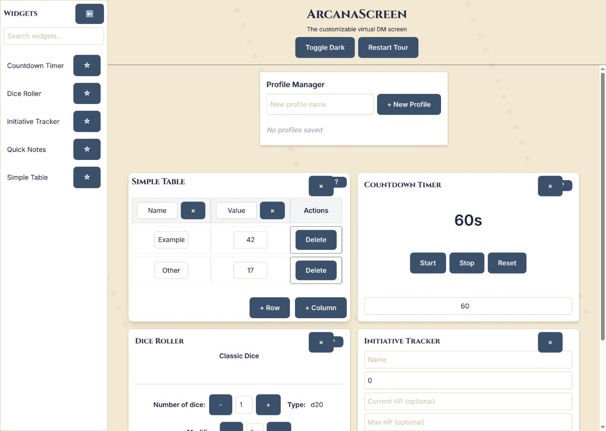
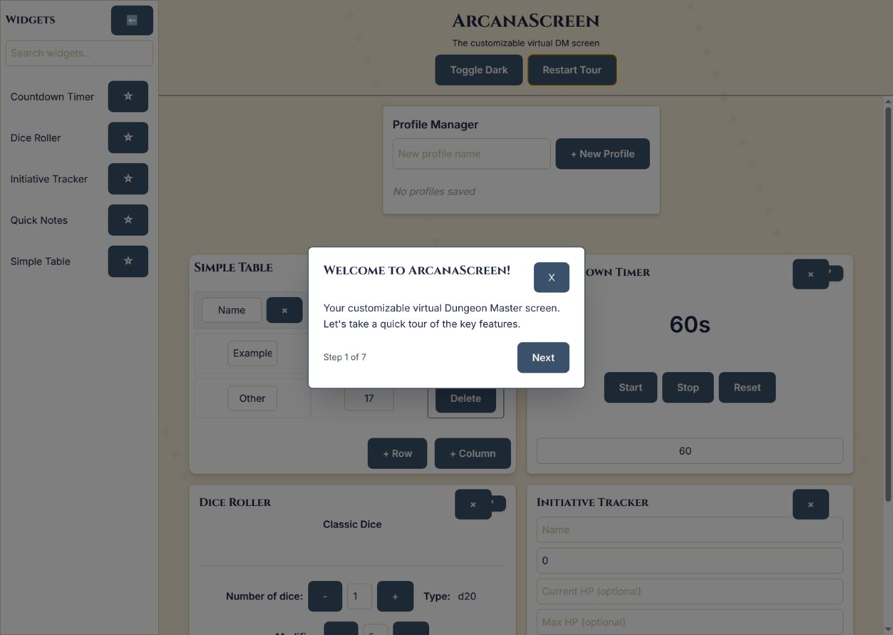
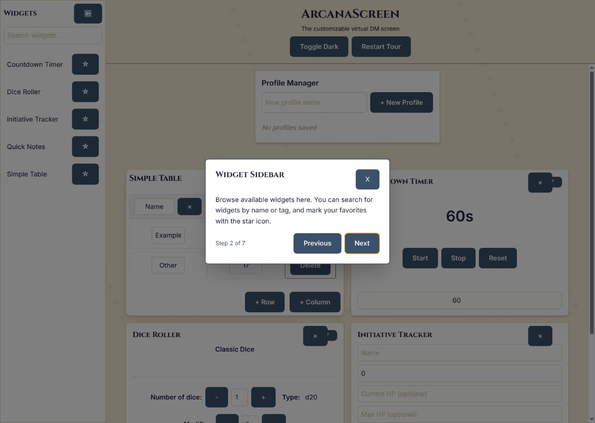
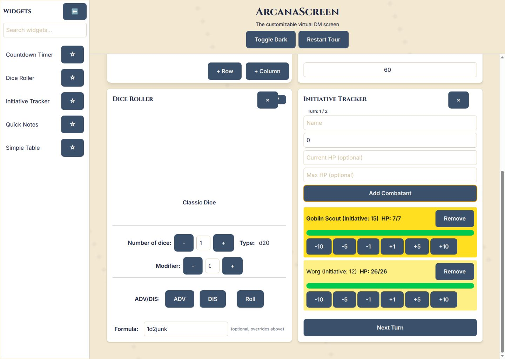
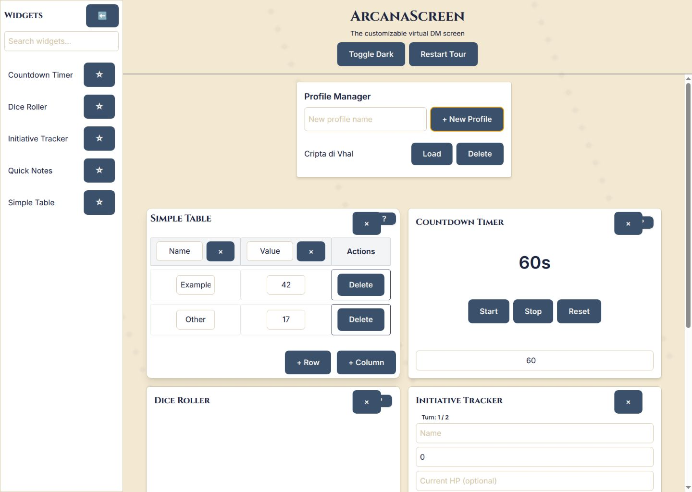

# ArcanaScreen — product experience audit

## Scope

Combined UX and visual-accessibility review of the desktop flow at 1440×1024: enter a session, understand the product, discover tools, run an encounter, and save the session. Evidence was captured from the local app on 2026-07-11.

## Overall verdict

ArcanaScreen exposes useful DM utilities, but it behaves like a widget demo rather than a session-running product. Preparation, live play, customization, and file management all compete on the same surface. The result is high visual noise, weak hierarchy, and too much manipulation during moments that should feel immediate.

## Flow steps

### 1. Session dashboard — poor

- Strength: the available tools and existing widgets are visible immediately.
- UX risk: every widget has nearly the same visual weight, while the profile manager, theme control, onboarding control, and widget library occupy permanent prime space. The screen does not reveal what is currently happening in the session or what the DM should do next.
- UX risk: adding a tool depends on understanding drag-and-drop; the sidebar does not present a clear add action.
- Accessibility risk: several compact icon-only controls rely on context and position. Focus and keyboard behavior need separate testing.

### 2. Onboarding welcome — weak

- Strength: the tour can be skipped and reports progress.
- UX risk: the tour introduces the application rather than helping the DM reach a meaningful first outcome. The dense, already-populated workspace remains visible behind the modal and competes for attention.
- Accessibility risk: the dimmed background and modal hierarchy look understandable, but focus trapping, Escape handling, reading order, and screen-reader announcements require functional testing.

### 3. Widget discovery — weak

- Strength: search and favorites are explained.
- UX risk: a seven-step feature tour teaches the implementation model (“widgets”) instead of the user model (“prepare a scene” or “start an encounter”). The referenced sidebar is not visually isolated, and the key drag gesture remains abstract.
- UX risk: favorites solve library organization before the product has established a primary workflow.

### 4. Live encounter — poor

- Strength: initiative sorting, turn progression, and hit-point changes are available in one place.
- UX risk: the creation form remains dominant after combat begins. Repetitive HP buttons and destructive controls consume attention; the current encounter must share equal space with a dice widget and the persistent library.
- UX risk: the active turn is encoded mainly by a yellow row, and there is no strong scene, round, or phase context.
- Accessibility risk: color is doing too much state communication. Numeric inputs and increment buttons need programmatic labels that include the combatant and effect. Keyboard and screen-reader behavior were not fully tested.

### 5. Saved session — weak

- Strength: creation feedback appears immediately and the saved item can be loaded.
- UX risk: “Profile” is a technical abstraction, not the DM’s mental model of campaign, adventure, or session. Create, load, and delete are mixed into the live workspace with no active-state indicator, modified timestamp, or confidence about whether later edits are saved.
- Accessibility risk: Delete has the same visual treatment as normal actions; confirmation and recovery were not tested.

## Product opportunities

1. Make the session—not the widget—the primary object. Use campaign → session → scene/encounter as the information model.
2. Separate Prepare and Run modes. Preparation can expose layout and library controls; Run mode should suppress editing chrome and keep the current scene, initiative, notes, dice, and timer within one glance.
3. Replace the permanent widget marketplace with a compact add-tool command or contextual drawer.
4. Turn encounter management into a focused workflow: setup, live turn state, and resolution should be distinct states.
5. Treat visual theming as atmosphere, not ornament. Preserve an arcane identity through restrained materials, typography, and motion while keeping dense controls highly legible.
6. Design keyboard, focus, labels, contrast, and non-color state cues as part of the interaction model from the beginning.

## Evidence limits

This review is based on the captured desktop states and observed interactions. It does not claim WCAG compliance. Responsive reflow, zoom, keyboard traversal, screen-reader output, drag-and-drop alternatives, persistence failure, destructive confirmation, and error recovery still require dedicated testing.
